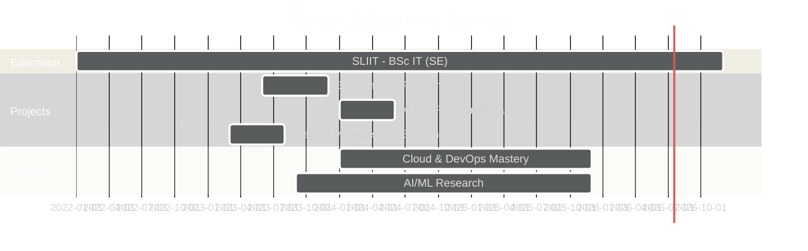

<div align="center">
  
</div>


  

  <p align="center">
    
    
  </p>
</div>

---

### Who is Chathura Jayashan ?
I am a **Software Engineering Undergraduate** at **SLIIT** specialized in high-availability systems and automated infrastructure. My approach combines **Full-Stack Development** with a rigorous **DevSecOps** mindset, ensuring that applications are not only feature-rich but also scalable, secure, and intelligently driven by **AI/ML** frameworks.

BSC.Hons in Information Technology Specialized in Software Engineering

---

### 🛠️ Technical Ecosystem

#### 🏗️ Web, Mobile & Animations
| Category | Technologies |
| :--- | :--- |
| **Frontend** |       |
| **Mobile** |     |
| **UI/UX & 3D** |     |
| **State & Data** |     |

#### ⚙️ Backend, Cloud & DevOps
| Category | Technologies |
| :--- | :--- |
| **Backend** |      |
| **Cloud** |     |
| **DevOps** |      |
| **Net & Sec** |     |

#### 🧠 AI, ML & Monitoring
| Category | Technologies |
| :--- | :--- |
| **Frameworks** |     |
| **NLP** |    |
| **Monitoring** |    |

---

### 🚀 Featured Projects & Repositories

<div align="center">
  <a href="https://github.com/3chathurajayashan/repo1">
    
  </a>
  <a href="https://github.com/3chathurajayashan/repo2">
    
  </a>
</div>

<div align="center">
  <a href="https://github.com/3chathurajayashan/repo3">
    
  </a>
  <a href="https://github.com/3chathurajayashan/repo4">
    
  </a>
</div>

---

### 💼 Professional Experience Timeline


---

### 🎯 Current Focus & Goals

<table>
  <tr>
    <td align="center" width="33%">
      
      <br><strong>Code Quality</strong>
      <br><sub>Clean Architecture & Design Patterns</sub>
    </td>
    <td align="center" width="33%">
      
      <br><strong>Cloud Native</strong>
      <br><sub>Microservices & Serverless Architecture</sub>
    </td>
    <td align="center" width="33%">
      
      <br><strong>AI Integration</strong>
      <br><sub>LLMs & Intelligent Automation</sub>
    </td>
  </tr>
</table>

---

### 📊 Performance & Statistics

<div align="center">
  
  
</div>

<div align="center">
  
</div>

---

### 📈 Activity & Achievements
<div align="center">
  
  <br/>
  
</div>

---

### 🏅 Certifications & Achievements

<div align="center">

| Certification | Issuer | Status |
|:---:|:---:|:---:|
| 🎓 AWS Certified Solutions Architect | Amazon Web Services | In Progress |
| 🎓 Certified Kubernetes Administrator | CNCF | Planned |
| 🎓 Professional Scrum Master I | Scrum.org | Planned |
| 🏆 Project Competition Winner | HayCarb System  | ✅ Achieved |

</div>

---

### 💡 Latest Blog Posts & Insights

<!-- BLOG-POST-LIST:START -->
<div align="center">
  
  📝 [Building Scalable Microservices with Spring Boot](#) • *Jan 2026*
  
  📝 [Docker vs Kubernetes: When to Use What](#) • *Dec 2025*
  
  📝 [AI-Powered Code Reviews: The Future](#) • *Nov 2025*
  
</div>
<!-- BLOG-POST-LIST:END -->

---

### 🎮 Hobbies & Interests

<div align="center">
  
  
  
  
  
</div>

---

### 🌐 Development Philosophy

> **"Code is poetry written for machines to execute and humans to maintain."**

<div align="center">
  <table>
    <tr>
      <td align="center">🎨<br/><strong>Clean Code</strong></td>
      <td align="center">🔒<br/><strong>Security First</strong></td>
      <td align="center">⚡<br/><strong>Performance</strong></td>
      <td align="center">🧪<br/><strong>Test Driven</strong></td>
      <td align="center">📚<br/><strong>Documentation</strong></td>
    </tr>
  </table>
</div>

---

### 📊 Weekly Development Breakdown

<!--START_SECTION:waka-->
```text
TypeScript   12 hrs 15 mins  ████████████░░░░░░░░░  48.2%
Java         7 hrs 30 mins   ███████░░░░░░░░░░░░░░  29.5%
Python       3 hrs 45 mins   ███░░░░░░░░░░░░░░░░░░  14.8%
YAML         1 hr 10 mins    █░░░░░░░░░░░░░░░░░░░░   4.6%
Other        45 mins         ░░░░░░░░░░░░░░░░░░░░░   2.9%
```
<!--END_SECTION:waka-->

---

### 📫 Connect & Collaborate
<div align="center">
  <a href="https://linkedin.com/in/chathura-jayashan" target="_blank">
    
  </a>
  <a href="mailto:your.email@example.com">
    
  </a>
  <a href="https://twitter.com/yourusername" target="_blank">
    
  </a>
  <a href="https://dev.to/yourusername" target="_blank">
    
  </a>
</div>

<br />

### 💬 Random Dev Quote
<div align="center">
  
</div>

---

<div align="center">
  
  
  ### ⭐ Show some love by starring repositories you find interesting!
  
  
</div>
